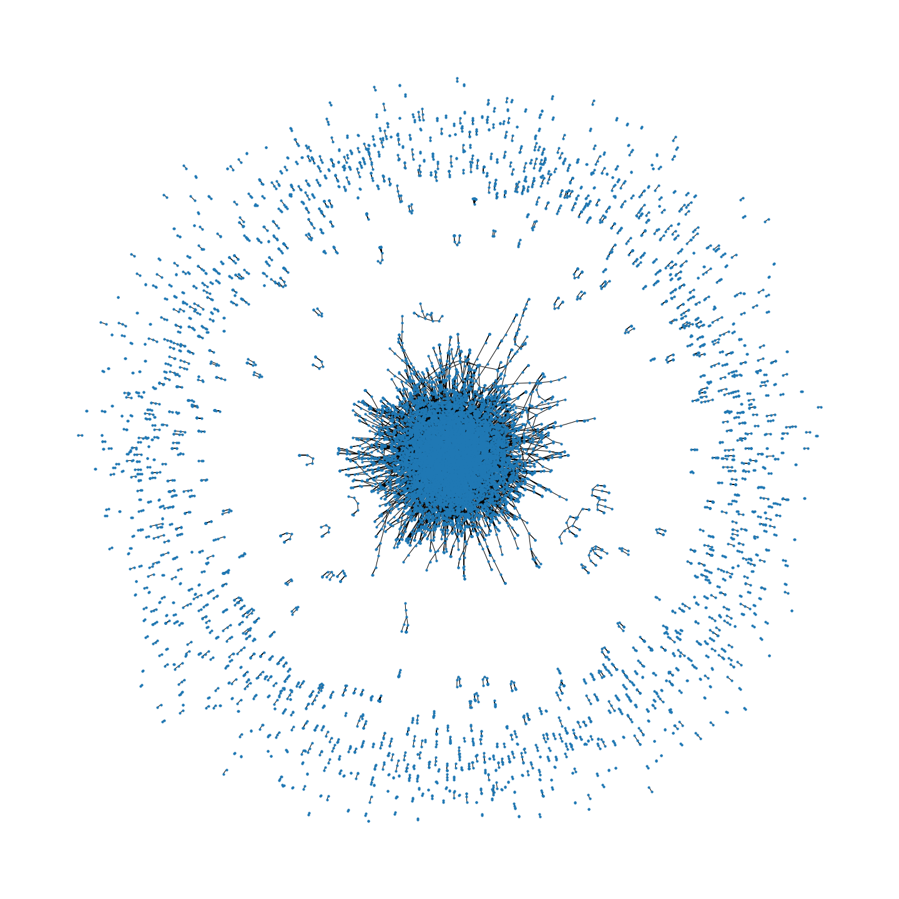

# Web Scraping EconLog Articles

### Project Overview
The goal is to explore the interconnectedness of blog posts by author Bryan Caplan on EconLog. Each article and the hyperlinks in the article represent a connected pair of nodes, from which a full network can be created.

Disclaimer: I did not obtain premission from the origanization to webscrape or otherwise use their data. 

### Author:
Greg Barbieri - [gfbarbieri](https://github.com/gfbarbieri)

### Web Scrape Article Contents
See the [Scrape_EconLog_Articles.ipynb](src/Scrape_EconLog_Articles.ipynb).

1. Extract a list of authors published on EconLog.
2. Extract the years an author published on EconLog. If my memory serves, EconLog organizes posts by year, so I have to loop over the years to access article content.
3. For each year, accumulate article metadata, including the article's title, date, author, and the article's URL.
4. For each article, extract the text of the article, any embedded URLs, and produce a word count.
5. Add the article's content from (4) to the articles metadata from (3).
6. Save the final content.

### Analysis
See [Article_Network.ipynb](src/Article_Network.ipynb)

1. Load article content.
2. Count total articles.
3. Plot articles per year.
4. Plot word count per article.
5. Create article network where each edge is an article URL and an embedded URL.

